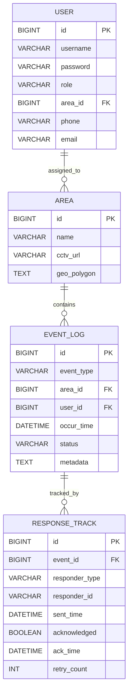

# 🏖️ 해수욕장 인구 밀집 CCTV 프로젝트 (가제)

**Spring Boot + Vue.js + OpenCV + YOLO + MySQL** 기반 실시간 해수욕장 인구 밀집 및 이상행동 탐지 시스템 — GitHub용 마크다운(시각화 포함)

---

## 📌 개요

여름철 해수욕장 안전을 위해 CCTV 영상을 분석하여 실시간 인구 밀집, 지정 구역 이탈, 10초 이상 누워있기 등 이상행동을 탐지하고 담당자/관리자에게 문자·메일을 전송하는 시스템입니다. 시스템은 영상 분석(파이썬 YOLO/OpenCV)과 서비스 로직(스프링부트)을 분리해 마이크로서비스 형태로 구성합니다.

---

## 🎯 핵심 요구사항 요약

- 메인 화면: 실시간 영상 출력(영상목록, 해수욕장 목록)
- 권한 기반 상세영상: 담당 구역 권한 부여
- 알림 전송: 문자·메일(3회 무응답 시 재전송/확대)
- 시각화: 날짜, 시간대별 인구 변화
- 이상행동 탐지: 지정구역 외 이동, 10초 이상 누워있기
- DB 저장: 탐지 이벤트, 유저·구역·로그

---

## 🏗️ 아키텍처 다이어그램 (Mermaid)

GitHub에서 바로 렌더링 가능한 Mermaid 다이어그램을 포함했습니다.

```mermaid
flowchart LR
  subgraph CCTV Layer
    CCTV1[CCTV camera 1]
    CCTV2[CCTV camera 2]
  end

  subgraph Edge/Stream
    StreamAgent[영상 수집기 (OpenCV)\nRTSP/HTTP를 받아 프레임 전처리]
  end

  subgraph Analysis
    YOLO[YOLO 분석 서비스\n(Python: ultralytics / PyTorch)]
    Tracker[Tracking & Event Detector\n(OpenCV + Kalman/DeepSORT)]
  end

  subgraph Backend
    SpringAPI[Spring Boot API 서버]\nDB[(MySQL)]
    NotificationSvc[Notification Service\n(SMS/Email/알림 로직)]
  end

  subgraph Frontend
    Vue[Vue.js SPA]\n    Admin[관리자 대시보드]
  end

  CCTV1 --> StreamAgent --> YOLO --> Tracker --> SpringAPI
  CCTV2 --> StreamAgent
  Tracker --> SpringAPI
  SpringAPI --> DB
  SpringAPI --> NotificationSvc
  SpringAPI --> Vue
  NotificationSvc --> SMS[문자] & Email[메일]
```

> 설명: 영상 수집(OpenCV)은 프레임을 자르고 전처리해 YOLO 서비스에 POST. YOLO는 객체(사람) 검출 결과를 반환하고, 트래킹/행동분석 모듈이 이벤트(구역이탈/누움)를 판단해 Spring API로 전송.

---

## 🗺️ DB ERD (Mermaid)



---

## 🧩 컴포넌트 상세 설명

### 1) 영상 수집기 (Edge/Stream)

- 역할: RTSP/HTTP 스트림을 받아 프레임 단위로 전처리(크롭, 리사이즈, 색보정)
- 구현: Python + OpenCV 실행 스크립트 (도커로 edge 서비스 구축 추천)
- 출력: 프레임을 분석 서비스(REST/gRPC)로 전송하거나, 로컬 폴더/메시지 큐에 저장

### 2) YOLO 분석 서비스 (Python)

- 역할: 객체 감지(YOLOv8 등), 바운딩박스+confidence 반환
- 입력: 단일 프레임 또는 배치
- 출력: JSON (객체 리스트, 좌표, score, class)

### 3) Tracking & Event Detector

- 역할: 객체 트래킹(ID 유지), 행동 감지(누움, 정체, 구역 이탈)
- 기법: DeepSORT/ByteTrack 또는 간단 Kalman + IoU 트래커
- 룰 예: 특정 객체가 10초 이상 누워있다면 `LYING_DOWN` 이벤트 발생

### 4) Spring Boot 서비스

- 역할: 인증/권한, 이벤트 수신(API 엔드포인트, DB 저장), 알림 트리거, 관리자 대시보드용 API
- 연동: Python 분석 서비스는 이벤트 발생 시 `POST /api/v1/events`로 전송

### 5) Frontend (Vue.js)

- 역할: 실시간 스트리밍(영상 플레이어), 이벤트 알림, 시각화(Chart.js), 담당자 로그인·권한관리

---

## 🔧 Python: YOLO + OpenCV 모듈 예시

아래는 Ultraytics YOLO 기반 간단한 파이썬 모듈 및 Flask wrapper 예시입니다. 실제 운영에서는 FastAPI + Uvicorn 권장(비동기).

### requirements.txt

```
opencv-python
ultralytics
fastapi
uvicorn[standard]
numpy
requests
pillow
```

### detector/app.py (FastAPI 예시)

```python
from fastapi import FastAPI, File, UploadFile, HTTPException
from ultralytics import YOLO
import numpy as np
import cv2
import io
import base64
import time
import requests

model = YOLO('yolov8n.pt')  # 가벼운 모델 예시
app = FastAPI()

# health
@app.get('/health')
def health():
    return {'status': 'ok'}

# 이미지 업로드 기반 감지(디버그/테스트용)
@app.post('/detect/image')
async def detect_image(file: UploadFile = File(...)):
    contents = await file.read()
    nparr = np.frombuffer(contents, np.uint8)
    img = cv2.imdecode(nparr, cv2.IMREAD_COLOR)

    results = model.predict(img, imgsz=640)
    dets = []
    for r in results:
        for box in r.boxes:
            x1, y1, x2, y2 = box.xyxy[0].tolist()
            conf = float(box.conf[0])
            cls = int(box.cls[0])
            dets.append({'bbox':[x1,y1,x2,y2], 'conf':conf, 'class':cls})
    return {'detections': dets}

# 스트림 프레임(바이너리) -> 감지 -> Spring API 전송 샘플
@app.post('/detect/frame')
async def detect_frame(frame_bytes: bytes = File(...)):
    nparr = np.frombuffer(frame_bytes, np.uint8)
    img = cv2.imdecode(nparr, cv2.IMREAD_COLOR)
    results = model.predict(img, imgsz=640)
    # 결과 파싱
    dets = []
    for r in results:
        for box in r.boxes:
            x1, y1, x2, y2 = box.xyxy[0].tolist()
            conf = float(box.conf[0])
            cls = int(box.cls[0])
            dets.append({'bbox':[x1,y1,x2,y2], 'conf':conf, 'class':cls})

    # 트래커/이벤트 로직은 별도 모듈에서 수행한다고 가정
    event_payload = {
        'camera_id': 'cam-01',
        'timestamp': int(time.time()),
        'detections': dets
    }
    # Spring API로 전송 (환경변수 또는 설정 사용 권장)
    SPRING_API = 'http://spring-api.internal:8080/api/v1/events'
    try:
        resp = requests.post(SPRING_API, json=event_payload, timeout=1.0)
    except Exception as e:
        # 로컬 로그 또는 큐에 저장 후 재시도
        print('failed to send event', e)

    return {'status':'ok','count':len(dets)}
```

### 트래킹 & 행위 감지(의사코드)

- 트래커는 프레임별 detection 결과를 받아 객체 ID를 유지
- 각 객체에 대해 다음 체크 수행:
  - `is_in_allowed_polygon(obj.center)` -> 아니면 `OUT_OF_ZONE`
  - `is_lying(obj)` -> (높이/너비 비율 + 없어진 움직임 지속시간 > 10s) -> `LYING_DOWN`
- 이벤트 발생 시 Spring API로 `POST /api/v1/events` 전송

---

## 🧾 Spring Boot: 분석 서비스 연동 예시

Python 감지 서비스가 이벤트를 전송하면 Spring Boot는 이를 수신하여 DB에 저장, 알림 트리거를 수행합니다.

### 1) 이벤트 수신 API (Controller)

```java
@RestController
@RequestMapping("/api/v1/events")
public class EventController {

    private final EventService eventService;

    public EventController(EventService eventService) {
        this.eventService = eventService;
    }

    @PostMapping
    public ResponseEntity<?> receiveEvent(@RequestBody EventPayload payload) {
        eventService.process(payload);
        return ResponseEntity.ok(Map.of("status","ok"));
    }
}
```

### 2) EventService (핵심 로직)

```java
@Service
public class EventService {
    private final EventRepository eventRepository;
    private final NotificationService notificationService;

    public void process(EventPayload payload) {
        // 1. 유효한 카메라인지 확인 -> area 매핑
        // 2. 이벤트 DB 저장
        EventLog e = new EventLog(...);
        eventRepository.save(e);
        
        // 3. 비즈니스 룰: 즉시 문자 발송 등
        notificationService.notifyAssignedManagers(e);
    }
}
```

### 3) Spring에서 Python 스트림 호출(테스트용)

- 만약 Spring에서 Python의 detect API를 호출해 즉시 결과를 받으려면 `WebClient` 사용 추천

```java
WebClient webClient = WebClient.create("http://detector:8000");
Mono<DetectionResponse> res = webClient.post()
    .uri("/detect/image")
    .contentType(MediaType.MULTIPART_FORM_DATA)
    .body(BodyInserters.fromMultipartData("file", resource))
    .retrieve()
    .bodyToMono(DetectionResponse.class);
```

---

## 🔔 알림(문자/메일) 흐름 및 재시도 로직

1. 이벤트 발생 → Spring 저장 → 담당자에게 SMS/메일 발송(1차)
2. 담당자 A가 ACK(수신 확인) 없을 시 3회 반복
3. 3회 무응답 발생 시: 다른 구역 담당자 B, 관리자에게 동시 알림
4. 모든 알림 로그는 `RESPONSE_TRACK`에 저장 → 감사 및 추적 가능

실무 팁: SMS는 Twilio, 국내는 알맞은 SMS 게이트웨이(카페24, 솔루션 업체)를 사용. 트랜잭션형 메일은 SendGrid/SES 또는 사내 SMTP.

---

## 🧪 실무 예제: 시나리오별 코드 스니펫

### A. 누워있는 사람 감지(의사코드, Python)

```python
# bbox: [x1,y1,x2,y2]
def is_lying(bbox, prev_positions):
    w = bbox[2] - bbox[0]
    h = bbox[3] - bbox[1]
    ratio = h/w
    # 행동 기준: 가로로 눕는 경우 ratio < 0.5
    if ratio < 0.5:
        # 움직임이 거의 없고 상태가 10초 이상 지속되면 true
        if stationary_time(prev_positions) > 10:
            return True
    return False
```

### B. 구역 이탈 (Geo polygon 체크)

```python
from shapely.geometry import Point, Polygon

polygon = Polygon(area_coords)  # area_coords: [(x1,y1), ...]
pt = Point(center_x, center_y)
if not polygon.contains(pt):
    # OUT_OF_ZONE 이벤트
```

> shapely 설치 권장: `pip install shapely`

---

## 🐋 Docker & 배포 간단 예시

- detector 서비스: `Dockerfile` (Python), `uvicorn`으로 실행
- spring-api: `Dockerfile` (JAR)
- docker-compose로 네트워크 연결

---

## ✅ 권장 단계별 개발 로드맵 (실무 관점)

1. PoC: 단일 카메라(로컬 비디오 파일)로 YOLO 감지 → Spring에 POST → DB 저장
2. 트래킹 추가(DeepSORT) → 누움/정지 판별 구현
3. 권한/인증(스프링 시큐리티) 및 Vue 대시보드 기본 구축
4. SMS/메일 인터페이스 연동(테스트 계정)
5. 멀티 카메라, 큐(RabbitMQ) 도입으로 안정성 개선
6. 성능 튜닝: 모델 경량화(yolov8n), GPU 활용, Batch 처리
7. 모니터링: Prometheus + Grafana (서비스 상태, 처리 지연)

---

## 📎 참고: 실무 팁

- 영상 프레임 전송 빈도를 낮춰 처리량을 줄이세요(예: 1초에 1\~2프레임).
- 트래킹이 핵심입니다. 잘 붙는 ID가 있어야 행동 감지가 정확합니다.
- 알림 정책(반복, 임계값)은 운영자와 함께 조정하세요.
- 개인정보(얼굴 등) 처리 시 법규(수집·저장·보관 기간)를 반드시 준수하세요.

---

## 📁 추가 자료(템플릿)

- `docker-compose.yml` 템플릿
- Python detector 샘플 코드
- Spring Event API 예제
- Vue 대시보드 기본 레이아웃

---
